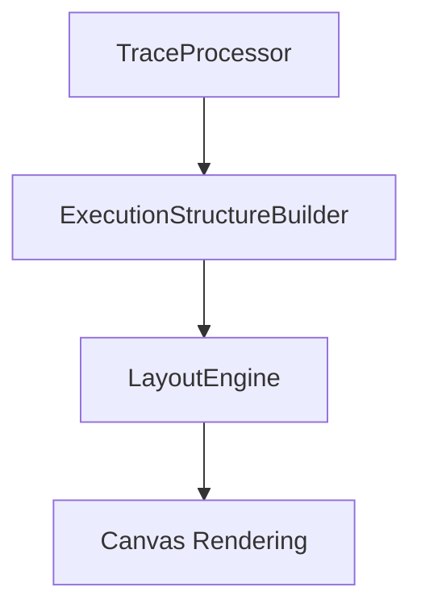

# EXECUTION_STRUCTURE_BUILDER_DESIGN.md

## Part 1 — Analyze Current System

The current execution-trace processing pipeline relies on a chain of three main components:

1.  **Backend Instrumentation-Tracer (`instrumentation-tracer.service.js`)**
    *   **ScopeDepth Generation:** Determined via a static analysis pre-pass (`buildScopeDepthMap`) that counts braces `{}`. It generates a map of line numbers to `{ start, max }` depths.
    *   **ConditionId Assignment:** Generated dynamically during trace conversion. A stable ID like `cond-frameId-line-callIndex` is assigned to `condition_eval` steps. This is propagated via a `conditionStack` within the call frame metadata.
    *   **Recursion Handling:** `frameId` is generated using a combination of function name and a global `globalCallIndex` (e.g., `main-0`, `factorial-1`), ensuring uniqueness across recursive calls.
    *   **Depth Propagation:** The `scopeDepth` is attached to each step based on the line-depth map.

2.  **Frontend Trace Processor (`traceProcessor.ts`)**
    *   Acts as a normalization layer. It flattens chunks, handles memory state accumulation, and ensures every step has a `scopeDepth`.
    *   **Inferred Depth:** If `scopeDepth` is missing from the backend, it uses an `inferredScopeDepth` variable that increments on `block_enter` and decrements on `block_exit`.

3.  **LayoutEngine (`LayoutEngine.ts`)**
    *   **Parent Resolution:** Uses `resolvePlacementParent`, which prioritizes finding an active control parent or loop container.
    *   **Deciding Ownership:** Ownership is determined by `getActiveControlParent`, which scans a `depthMap` for the current frame. It looks for the "deepest" active control body whose depth is less than or equal to the current step's `scopeDepth`.
    *   **Guesswork:** The engine "guesses" structural nesting by comparing integer depths. If two blocks have the same depth but separate logical lifetimes, the engine relies on `pruneControlDepthForScope` to clean up the map, which is a defensive but error-prone heuristic.

---

## Part 2 — Identify Root Problems

The current model is unstable because it treats **depth as character** rather than **identity as structure**.

### Identified Weaknesses:
*   **Depth Mismatch:** Single-line `if` statements or `return` expressions often occur at a depth that doesn't "match" the logical body of the branch. This causes steps to "jump" out of their containers.
*   **Missing Structural Markers:** If a `block_enter` or `block_exit` is missed (due to instrumentation gaps in complex C++ features), the entire depth-stack for the remainder of the trace drifts.
*   **Reliance on Lookahead/State:** `LayoutEngine` must maintain a complex `activeControlByDepth` map. If a step arrives with an unexpected depth, it might prune active parents prematurely.
*   **Recursive Ambiguity:** While `frameId` is unique, the *relationship* between siblings in a recursive call is often lost if they share the same line number and depth profile.

---

## Part 3 — Proposed New Architecture

Introduce a new layer: **ExecutionStructureBuilder**.



The `ExecutionStructureBuilder` transforms the flat list of steps from `TraceProcessor` into a **Deterministic Execution Tree**.
*   It resolves all parent-child relationships *before* `LayoutEngine` calculates any coordinates.
*   It removes "structural inference" from the `LayoutEngine`, turning it into a pure "Placement Engine".

---

## Part 4 — New Data Structures

The pipeline will now produce an `ExecutionGraph` object.

### JSON Schema

```json
{
  "ExecutionGraph": {
    "nodes": [
      {
        "nodeId": "node_0",
        "type": "function",
        "label": "main",
        "frameId": "main-0",
        "parentId": null,
        "children": ["node_1", "node_5"],
        "steps": [0, 10], 
        "depth": 0,
        "pathId": "main"
      },
      {
        "nodeId": "node_1",
        "type": "condition",
        "label": "if (x > 0)",
        "conditionId": "cond-main-0-10-5",
        "parentId": "node_0",
        "children": ["node_2"],
        "pathId": "main.1"
      }
    ],
    "nodeMap": {
       "node_1": { "...ref..." }
    },
    "stepToNode": {
       "0": "node_0",
       "1": "node_1"
    }
  }
}
```

*   **nodeId:** A unique identifier unrelated to step numbers.
*   **pathId:** A hierarchical string representing the control-flow branch (e.g., `main.1.true.1`).
*   **stepToNode:** A direct index allowing the `LayoutEngine` to look up the exact structural container for any step index.

---

## Part 5 — Path System

Paths represent **control-flow choices**, not execution sequence.

*   **Format:** `Root.[SubPathIndex].[BranchKey]`
*   **Examples:**
    *   `main`: The entry path.
    *   `main.0.true`: The "then" block of the first `if`.
    *   `main.0.false`: The "else" block.
    *   `main.1.[iter_0]`: The first iteration of a loop.

**Rule:** Function calls create a *new* local `Root` path for that `frameId`, but the `call_site` node in the parent path points to the child frame's root.

---

## Part 6 — Edge Cases

1.  **Recursion:** Each frame of a recursive function is a separate `node` branch in the tree. Parents are explicitly linked via `parentFrameId`.
2.  **Single-line `if`:** The Builder uses a lookahead to see if the next statement is at `depth+1`. Even without braces, it creates a virtual "body" node.
3.  **Early Returns:** When a `return` is encountered, the Builder closes all active nodes in the current path and marks subsequent steps in the same scope as unreachable/unattached (or attaches them to the frame root if they are cleanup).
4.  **Missing Events:** If `block_enter` is missing, the Builder uses `scopeDepth` transitions as a fallback but reconciles them against `condition_eval` IDs to ensure the tree doesn't break.

---

## Part 7 — Performance Impact

*   **Time Complexity:** $O(N)$ where $N$ is the number of steps. Building the tree is a single pass with a stack (similar to the current processor).
*   **Memory Usage:** Low overhead. Storing references between 10,000 steps and ~500 structural nodes adds negligible KB.
*   **Latency:** The `LayoutEngine` simplified logic (removing the depth-map scanning) will likely *offset* the time spent in the Builder. Total processing time is expected to remain under 50ms for 5,000 steps.

---

## Part 8 — Trace Transfer Overhead

*   **Strategy:** The `ExecutionStructureBuilder` runs **entirely on the frontend**.
*   **Benefit:** Zero increase in network transfer size. The backend remains focused on raw event emission.
*   **Memory:** We avoid duplicating step data by using `stepIndex` references in nodes.

---

## Part 9 — Benefits of New Architecture

1.  **Deterministic Ownership:** No more "drift" where children jump to the wrong parent.
2.  **Stable Recursion:** Each recursive depth is a first-class citizen in the tree.
3.  **Pruning Safety:** The Builder handles lifetime (when a node starts/ends) once, rather than re-calculating it every frame update.
4.  **Cleaner LayoutEngine:** `LayoutEngine` becomes a passive visitor of the tree.

---

## Part 10 — Migration Plan

1.  **Phase A (Parallel):** Implement `ExecutionStructureBuilder`. Calculate the `stepToNode` map but do not use it in `LayoutEngine` yet. Log discrepancies between the new parent resolution and the old depth-based one.
2.  **Phase B (Shadow):** Update `LayoutEngine` to use the new map for a subset of element types (e.g., variables) while keeping conditions on the old system.
3.  **Phase C (Cutover):** Full switch to `ExecutionStructureBuilder` as the source of truth for all `resolvePlacementParent` calls.
