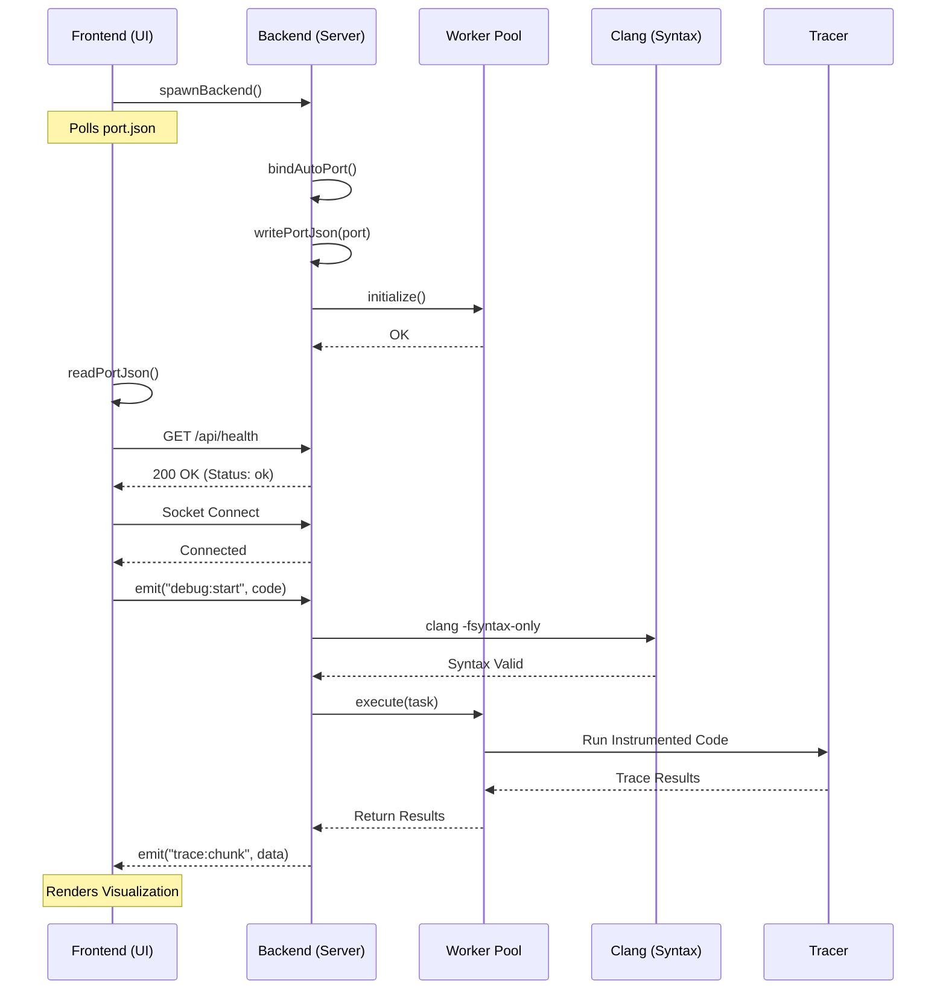
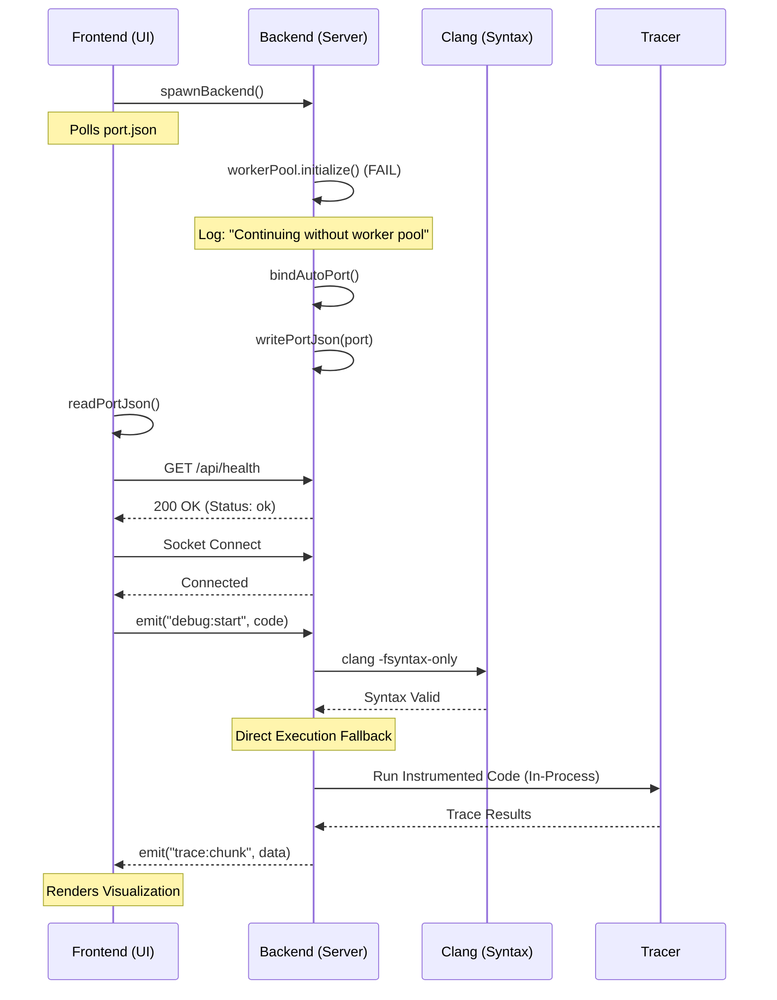

# Frontend-Backend Connection Diagrams

These diagrams illustrate the lifecycle and communication between the CodeViz frontend and backend, including the fallback mechanisms for resilience.

## 1. Connection Working (Happy Path)

This diagram shows the standard startup and execution flow when all components (including the worker pool) are functioning correctly.

---

## 2. Connection with Fallback (Resilient Path)

This diagram shows how the system recovers when the worker pool fails to initialize, falling back to direct execution mode to maintain functionality.

