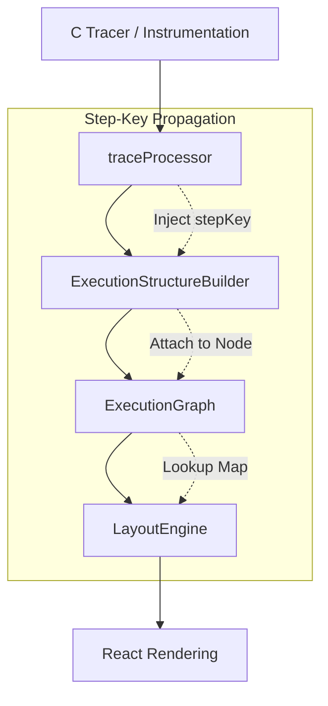
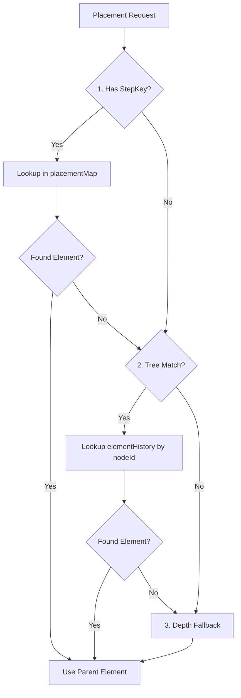

# Case Study: Step-Key Placement Architecture

## 1. Current System Analysis

The current CodeViz execution visualization system uses a sophisticated but occasionally non-deterministic pipeline for placing UI elements on the canvas.

### Architecture Overview
The pipeline consists of the following stages:



1.  **C Tracer / instrumentation**: Emits raw execution events.
2.  **traceProcessor**: Normalizes events into `ExecutionStep[]` and accumulates memory state.
3.  **ExecutionStructureBuilder (ESB)**: Builds an `ExecutionGraph` (tree) by resolving parent-child relationships using in-memory context stacks (`frameStack`, `conditionStack`, `loopStack`).
4.  **ExecutionGraph**: An explicit ownership tree that maps `stepIndex` to `nodeId`.
5.  **LayoutEngine (LE)**: Iterates through steps and calculates the (x, y) coordinates of UI elements.
6.  **React Rendering**: Concurrently renders elements based on the calculated layout.

### Current Placement Priority
Currently, `LayoutEngine.resolvePlacementParent` resolves the parent element for a new step using three layers:

1.  **Execution Tree Parent Lookup**:
    *   Uses `graph.stepToNode.get(stepIndex)` to find the graph node.
    *   Finds the `parentId` of that node.
    *   Attempts to find the corresponding UI element in `elementHistory`.
2.  **LayoutEngine Contextual Tracking**:
    *   Maintains `activeControlByDepth` and `ephemeralControlByDepth` maps.
    *   Tracks "bridges" between condition heads and bodies.
3.  **Depth Fallback System**:
    *   If tree lookup fails (often because the parent element hasn't been created/registered in `elementHistory` yet), it falls back to a scope-depth heuristic.
    *   It looks for the innermost active control element at or above the current `scopeDepth`.

### The Problem: Timing Races
In complex traces (especially recursion and nested conditionals), a "timing race" occurs. `LayoutEngine` may process a child step before the UI element for its parent node (e.g., a `condition_body`) has been fully registered in the `elementHistory`.

When this happens:
- The **Tree Lookup** fails because the parent element doesn't exist yet.
- The system defaults to **Depth Fallback**.
- If the depth tracking is even slightly off (due to ephemeral blocks or instrumentation gaps), the element is placed in the wrong parent or as a root element, leading to visualization glitches.

---

## 2. Step-Key Placement Design

To eliminate non-determinism, we propose the **Step-Key Placement System**. This system introduces a stable, globally unique identity for every execution event that results in a UI element.

### Step Identity Generation
Each `ExecutionStep` receives a `stepKey` during the trace processing phase.
- **Format**: `${frameId}-step-${stepIndex}`
- **Examples**: `main-0-step-46`, `factorial-11-step-9`

### Propagation through Pipeline
1.  **traceProcessor**: Injects `stepKey` into the `ExecutionStep` object.
2.  **ExecutionStructureBuilder**: Attaches the `stepKey` to the corresponding `ExecutionNode`.
3.  **ExecutionGraph**: Maintains a high-speed lookup map: `stepKey → nodeId`.
4.  **LayoutEngine**: Registers created elements in a `placementMap` (or enhanced `elementHistory`) keyed by their `stepKey`.

### New Placement Algorithm
The `resolvePlacementParent()` function in `LayoutEngine` is updated to the following priority:



```typescript
function resolvePlacementParent(step, node) {
  // 1. PRIMARY: Step-Key Placement
  // Find the tree-parent node, and see if its element already exists via its stepKey
  const treeParentNodeId = node.parentId;
  if (treeParentNodeId) {
    const parentNode = graph.nodeIndex.get(treeParentNodeId);
    if (parentNode?.stepKey) {
      const parentElement = placementMap.get(parentNode.stepKey);
      if (parentElement) return parentElement;
    }
  }

  // 2. SECONDARY: Execution Tree ID Lookup (Existing)
  // Fallback to searching elementHistory by nodeId
  const treeMatch = elementHistory.get(treeParentNodeId);
  if (treeMatch) return treeMatch;

  // 3. FAILSAFE: Depth Fallback (Existing)
  return depthFallback(step.scopeDepth);
}
```

---

## 3. Implementation Plan

### tracer / traceProcessor
Add a normalization step to ensure every step has a `stepKey`.
```typescript
step.stepKey = `${step.frameId}-step-${index}`;
```

### ExecutionStructureBuilder
Update the `ExecutionNode` interface and assigning the key during node creation.
```typescript
interface ExecutionNode {
  nodeId: string;
  stepKey?: string; // NEW
  // ...
}

// In handleFuncEnter / handleVariable / etc:
const node = this.createNode({
  nodeId,
  stepKey: raw.stepKey,
  // ...
});
```

### LayoutEngine
Introduce the `placementMap` and update the resolution logic.
```typescript
class LayoutEngine {
  private static placementMap: Map<string, LayoutElement> = new Map();

  // In processStep:
  const element = createLayoutElement(step);
  if (step.stepKey) {
    this.placementMap.set(step.stepKey, element);
  }
}
```

---

## 4. Edge Cases

### Recursion
Step keys are inherently safe for recursion because they include the `frameId` (e.g., `factorial-11`, `factorial-12`), which is incremented for every call. Each instance of a function has unique step indices within its frame context or globally unique indices in the flat trace.

### Loops
Each iteration in the `ExecutionGraph` is represented by a `loop_iteration` node. By assigning a stable `stepKey` to the `loop_body_start` or `loop_iteration` event, all children within that iteration can deterministically find their parent iteration container.

### Conditions
Conditional branches often create "ephemeral" bodies. StepKeys ensure that even if a body element is created and then quickly replaced or updated, the child elements remain "locked" to the identity of the step that created the body, not just a transient depth level.

### Asynchronous UI Creation
In environments where UI elements might be created out of order or lazily, the `stepKey` serves as a permanent anchor. Even if a child arrives before its parent is "rendered" in the DOM, the `LayoutEngine` (which maintains the logical map) can resolve the relationship correctly.

---

## 5. Memory Impact

The memory overhead is negligible.
- **Data Structure**: A `Map<string, Element>` or adding a string field to existing objects.
- **Estimate**: 
  - `stepKey` string: ~20-40 bytes.
  - 100,000 steps: ~4MB of string data.
  - `Map` overhead: ~2MB.
- **Total**: ~6MB for a very large trace, which is a small fraction of the total `ExecutionGraph` and `MemoryState` overhead (often hundreds of MBs).

---

## 6. Performance Impact

- **Lookup Complexity**: `Map.get()` is $O(1)$.
- **Current System**: Often requires $O(n)$ scanning of depth maps or parent chains in the worst cases.
- **Benefit**: Faster `LayoutEngine` processing and more stable React reconciliations, as `stepKey` can also serve as a stable React `key`.

---

## 7. Advantages

1.  **Strict Determinism**: Placement no longer depends on "what happened recently" (depth), but on "who is my owner" (tree + identity).
2.  **Eliminates Race Conditions**: Children can find parents even if the parent was just created in the same tick.
3.  **Simplified Logic**: Reduces the reliance on complex "bridge" and "history" tracking in `LayoutEngine`.
4.  **Debugging**: Provides a clear audit trail. You can say "Element X was placed in Parent Y because of stepKey Z".

---

## 8. Compatibility

The system is **fully backward compatible**.
- The `ExecutionGraph` still maintains `parentId` and `parentId` hierarchies.
- The `LayoutEngine` still maintains the depth fallback as a "Level 3" failsafe.
- If a step lacks a `stepKey`, it simply skips to Step 2 or 3 of the resolution algorithm.

---

## 9. Migration Strategy

We recommend a phased rollout:
1.  **Phase 1**: Update `traceProcessor` to generate keys and `types` to support them.
2.  **Phase 2**: Update `ExecutionStructureBuilder` to propagate keys into the graph nodes.
3.  **Phase 3**: Implement `placementMap` in `LayoutEngine` but keep it disabled (shadow mode).
4.  **Phase 4**: Enable `Step-Key` as the primary resolution mechanism.
5.  **Phase 5**: Cleanup legacy depth-tracking logic once stability is confirmed.

---

## 10. Final Recommendation

The **Step-Key Placement System** is a critical upgrade for CodeViz. It moves the visualization from a "best-effort" heuristic placement to a "guaranteed" deterministic placement. We recommend immediate implementation of Phase 1 and 2 to begin the transition.
